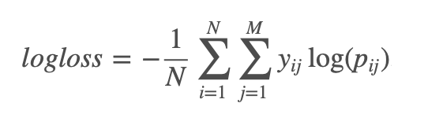

# Crime Classification
> Using Pyspark to classify the crime into 30 categories.

## Data

Explanation of the data fields is as follows:

1. Index: index of the record (no relevant to the prediction result)

2. Date: timestamp of the crime incident

3. Category: category of the crime incident. (This is the target variable you are going to predict)

4. Description: detailed description of the crime incident (only in train.csv)

5. DayOfWeek: the day of the week

6. PdDistrict: name of the Police Department District

7. Resolution- how the crime incident was resolved (only in train.csv)

8. Address-  the  approximate  street  address  of  the  crime  incident(  “/”  means intersection of two roads)

9. X- Longitude

10. Y- Latitude

## Model Training

Logistic Regression  
Decision Tree

## Evaluation

The result are evaluated using the multi-class logarithmic loss. The formula is here:

Where N is the number of cases in the test set, M is the number of class labels.

Log is the natural logarithm, yij is 1 if case i is in label j and 0 otherwise, and pij is the probability that case I belongs to label j. The log loss value of the model should be minimized. 

## Development setup

Pyspark Installation

https://changhsinlee.com/install-pyspark-windows-jupyter/

Folium Installation

https://python-visualization.github.io/folium/installing.html#installation

